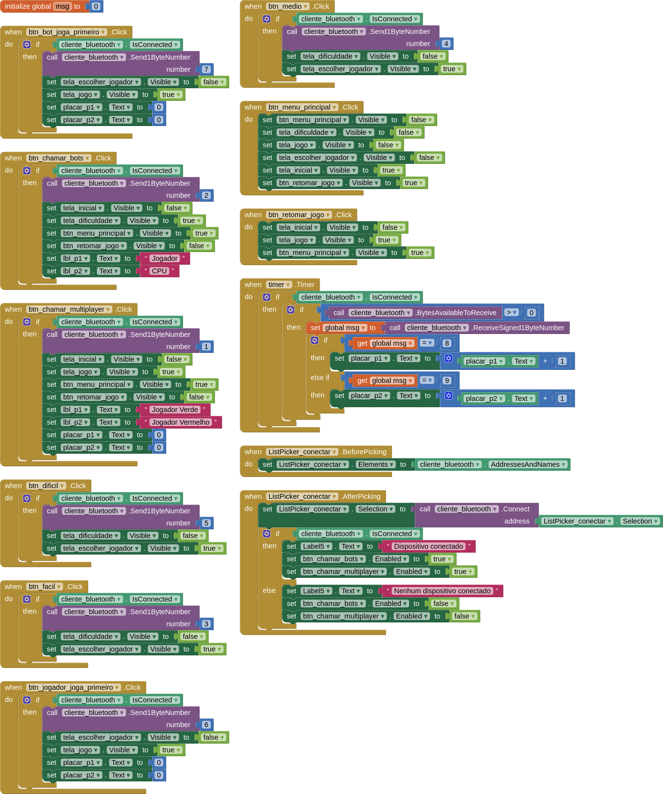
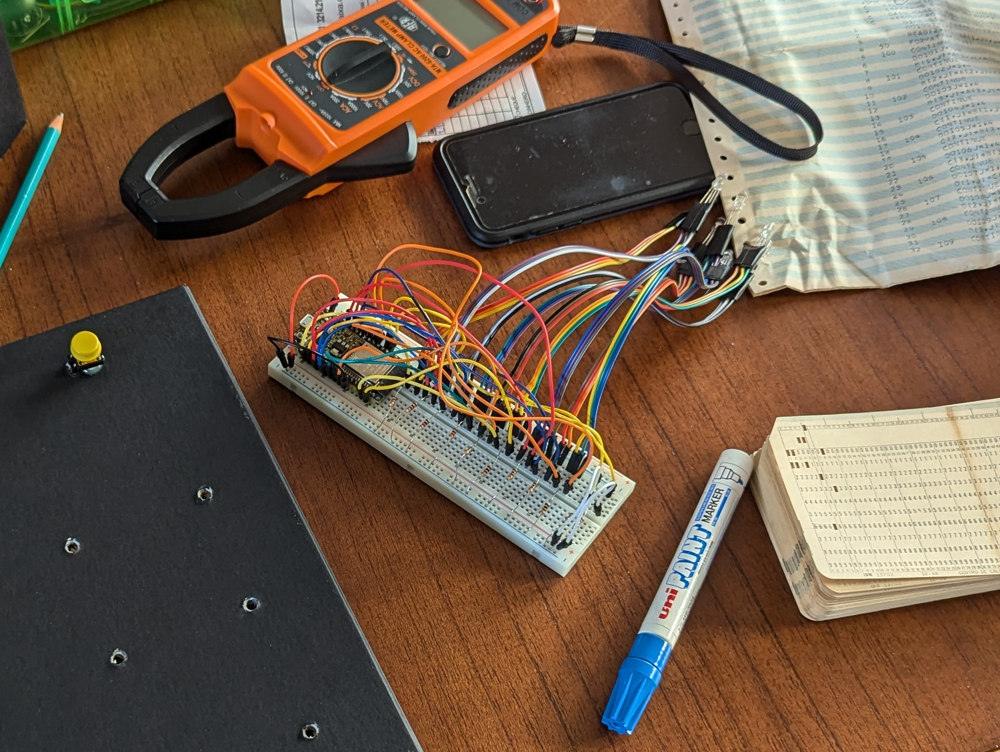
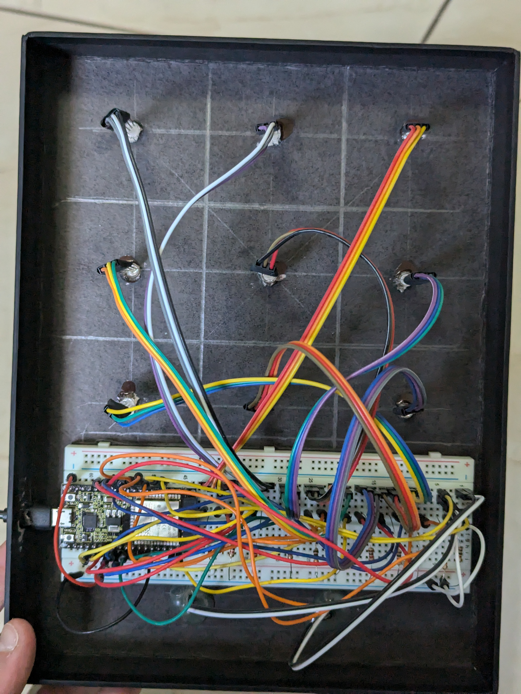
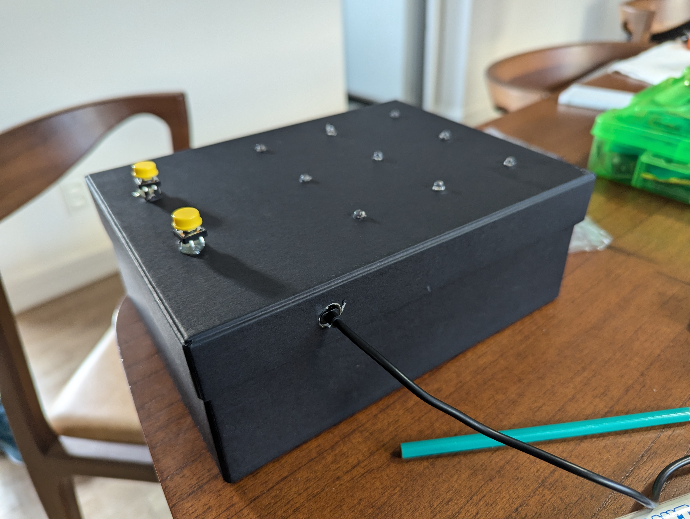

# Desenvolvimento

## Materiais

Os materiais utilizados no projeto foram:

- Um microcontrolador
  [DevKit ESP32 (KS0413)](https://github.com/keyestudio/KS0413-Keyestudio-ESP32-Core-Board-_Black-and-Eco-friendly/blob/master/KS0413.md).
- Uma protoboard de 830 pontos.
- Uma caixa de papelão de alta qualidade.
- Nove LEDs RGB (cátodo comum).
- Dois Push Buttons 12x12mm com capa amarela.
- 11 resistores de 1kΩ.
- 31 jumpers com conectores macho-fêmea.
- 22 jumpers com conectores macho-macho.
- Um cabo adaptador USB-A para Micro-USB.
- Cola quente e Super Bonder.

## Desenvolvimento do Aplicativo

### Interface

A interface foi desenvolvida de forma simples, com poucas telas para a
configuração do jogo, e uma tela para acompanhar o jogo com um placar de
vitórias. Tendo dividido assim as telas, determinou-se o layout dos elementos:

- **Menu Principal**: sendo a primeira tela, adicionou-se um botão para
  selecionar cada modo de jogo, Singleplayer e Multiplayer, e um botão
  “Conectar” para estabelecer a conexão Bluetooth entre o aplicativo e o
  microcontrolador. Além desses, adicionamos um botão de “Voltar ao jogo”, que
  só é visível quando uma partida já está em progresso.
- **Escolha de Dificuldade**: ao escolher o modo Singleplayer, a segunda tela
  apresenta quatro botões, três dos quais são usados para selecionar a
  dificuldade do jogo: fácil, normal, ou difícil. Também incluímos um botão de
  “Voltar ao menu principal”, para cancelar a escolha.
- **Escolha de Jogador**: ao escolher a dificuldade, a terceira tela apresenta
  dois botões, um dos quais fará o computador jogar primeiro, enquanto o outro
  fará com que o usuário jogue primeiro. O mesmo botão de “Voltar ao menu
  principal” foi incluido, e, aqui, também cancela a configuração do jogo.
- **Tela de Jogo**: finalmente, a tela de jogo aparece quando a primeira partida
  se inicia. Ela conta com um placar de dois números, incialmente zero, para o
  primeiro e o segundo jogador (em caso de jogo Multiplayer), ou para o jogador
  e o computador (em caso de jogo Singleplayer). O botão de “Voltar ao menu
  principal” está aqui também mas, nesse caso, pressioná-lo não cancelará o
  jogo, pois no menu principal será possível selecionar o botão “Voltar ao
  jogo”. Portanto, o menu principal passa a funcionar como um menu de _pause_.

### Código

Como descrevemos [na discussão dos testes](04-Testes.md), não foi possível
implementar as telas do aplicativo como telas próprias do _App Inventor_. Por
isso foram representadas como `VerticalArrangement`, e a a mudança entre as
telas é feita tornando cada arranjo visível ou invisível. Para cada botão, foi
adicionado um bloco determinando qual mudança de tela será feita, e qual código
numérico será enviado ao microcontrolador via Bluetooth quando for pressionado.

Adicionamos, também, blocos determinando que, ao selecionar o botão “Conectar”,
os elementos da lista de seleção serão iguais aos endereços e nomes dos
dispositivos detectados pelo cliente Bluetooth. Ao efetivar, nela, a escolha do
microcontrolador, um outro bloco executa, realizando a conexão, e mostrando na
tela uma mensagem indicando se a conexão teve êxito ou não. Finalmente, um bloco
_Timer_ verifica constantemente se algum código foi recebido do microcontrolador
via Bluetooth e, se for o caso, guarda o código em uma variável global e,
dependendo de qual for, realiza procedimento apropriado.

## Desenvolvimento do Hardware

### Montagem

O primeiro protótipo consistiu de nove LEDs RGB conectados à protoboard com
ternos de jumpers de conectores macho-fêmea, deixando o pino do diodo azul
desconectado, pois ele não é necessário. Para o _ground_ de cada LED,
conectamo-lo por meio de um resistor à linha negativa da protoboard, e para cada
pino dos diodos verde e vermelhos, conectamo-lo a uma das portas GPIO do
microcontrolador por meio de jumpers macho-macho. Isso exigiu um número maior de
jumpers, mas constituiu uma montagem marginalmente mais organizada. Veja o
protótipo abaixo:

Deivido à instabilidade da conexão, usamos fita isolante para prender os pinos
dos LEDs aos conectores fêmea dos jumpers e garantir que será sempre possível
fechar o circuito. Como descrito [na seção de testes](04-Testes.md), esse
protótipo teve que ser desmontado e refeito. Quando foi comprovado que todos os
LEDs estavam funcionando e corretamente mapeados no código, adicionamos os Push
Buttons, usando o mesmo padrão de jumpers macho-fêmea, macho-macho, e
resistores. Uma vez instalados, terminamos e testamos extensivamente o código do
microcontrolador — com exceção da implementação do Bluetooth — e instalamos a
montagem na caixa.

Inicialmente, haviamos considerado colar as protoboards (pois não sabíamos se
apenas uma seria suficiente), usando a fita dupla-face que elas incluem, às
laterais da parte interna da caixa, mas logo percebemos que seria mais fácil
utilizar e fazer a manutenção do projeto se a montagem inteira fosse colada à
parte interna da tampa. Isso faria com que fosse conveniente abrir a caixa,
tanto para fazer manutenção quanto para guardar o manual impresso e o cabo
Micro-USB, quando não estiver em uso. Após tomar as medidas da tampa e dos
componentes e comprovar que seria possível, decidimos fazer isso.

Com lápis e esquadro, então, determinamos as posições da protoboard, de cada
LED, e dos dois botões com marcações no interior da tampa. Usando uma furadeira,
fizemos furos de 5mm de diâmetro para cada LED — fazendo com que se encaixassem
com firmeza e facilidade — e quatro furos de tamanho semelhante para os
conectores fêmea dos jumpers dos botões, firmando os conectores com cola quente
no lado interno. Além disso, fizemos um furo com diâmetro de aproximadamente
15mm na lateral da tampa, para a saída do cabo adaptador Micro-USB, e um corte
correspondente na caixa, para que seja possível tampá-la e destampá-la sem
desconectar o cabo.

Com todos os furos feitos, instalamos primeiro os botões, fixando-os com cola
quente e Super Bonder aos conectores. Depois, colamos a protoboard usando fita
dupla-face, conectando os jumpers dos botões a ela novamente, e, finalmente,
encaixamos os LEDs nos furos de 5mm e os fixando com Super Bonder. A montagem
final pode ser vista abaixo:

### Desenvolvimento do Código

Descreva como foi o desenvolvimento do código do arduino/ESP.

## Comunicação entre App e Hardware

Descreva como foi o processo de comunicação entre App e arduino/ESP.