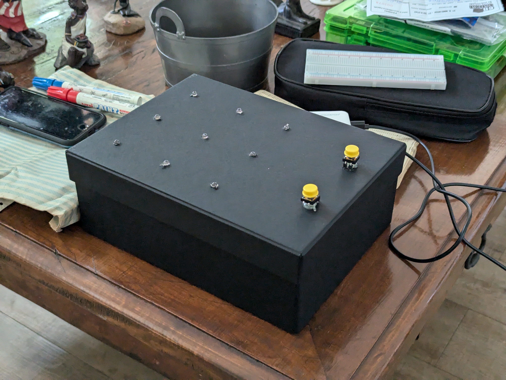

<!-- LTeX: language=pt-BR -->

# Jogo da Velha Automático

`PUC Minas — Unidade Praça da Liberdade`

`Engenharia de Computação`

`2024/1 (1º Período)`

`Laboratório de Introdução à Engenharia de Computação`

## Integrantes

- Amanda Canizela Guimarães
- Antonella de Paula Menegaz
- Felipe de Faria Rios Coelho
- Lucas Alvarenga Fernandes
- Lucca Mendes Alves Pellegrini

## Orientador

- Felipe Augusto Lara Soares

## Resumo

Este repositório contém a apresentação, o código, e a documentação do projeto
“Jogo da Velha Automático”, desenvolvido no primeiro período do curso de
Engenharia de Computação da PUC Minas Praça da Liberdade. O projeto é
constituído por uma montagem (veja a figura acima) contando com uma matriz de
nove LEDs e dois botões, governados por um microcontrolador
[DevKit ESP32](https://www.espressif.com/en/products/socs/esp32). Trata-se de
uma implementação do
[Jogo da Velha](https://pt.wikipedia.org/wiki/Jogo_da_velha), opcionalmente
controlada por um aplicativo de smartphone via Bluetooth ou por um computador
via USB.

O projeto conta com dois modos de jogo: jogador contra jogador, e jogador contra
computador. No primeiro desses, os jogadores definem entre si quem jogará
primeiro. Já no segundo modo, o usuário tem a opção de escolher quem vai jogar
primeiro, e de selecionar um de três níveis de dificuldade; isso pode ser feito
pelo aplicativo de smartphone, que conta com um placar para registrar a
pontuação, ou pelo computador, com uma conexão USB. Um terceiro modo de jogo,
computador contra computador, é incluído como uma opção em situações de
_debugging._

# [Código Fonte do Microcontrolador](Codigo/README.md)

O código-fonte está [aqui](Codigo), sendo desenvolvido usando
[PlatformIO](https://platformio.org/).

# [Aplicativo para Smartphone](App/README.md)

O aplicativo está [aqui](App), sendo desenvolvido usando o
[MIT App Inventor](https://appinventor.mit.edu/).

# [Apresentação](Apresentacao/README.md)

[Aqui](Apresentacao/README.md), se encontram todas as demonstrações visuais do
projeto, com explicações.

[Configuração Inicial](https://github.com/ICEI-PUC-Minas-EC-TI/ppl-ec-2024-1-p1-liec-t1-g2-jogo-da-velha/assets/169660385/9835e238-2499-46d9-83b2-a269165461b0)

# [Manual de Utilização](Manual/README.md)

Um breve manual contendo instruções de configuração e uso do dispositivo se
encontra [aqui](Manual).

# Documentação

1. [Introdução](Documentacao/01-Introducão.md)
2. [Metodologias Ágeis](Documentacao/02-Metodologias%20Ágeis.md)
3. [Desenvolvimento](Documentacao/03-Desenvolvimento.md)
4. [Testes](Documentacao/04-Testes.md)
5. [Conclusão](Documentacao/05-Conclusão.md)
6. [Referências](Documentacao/06-Referências.md)